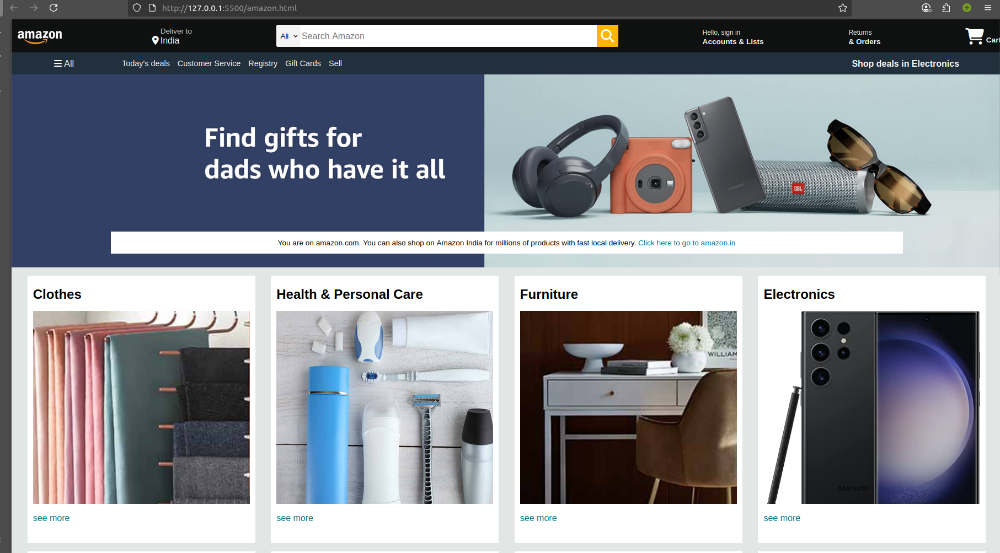

📌 Overview

This project is a static Amazon.com homepage clone built using HTML and CSS only.
It replicates the basic layout, colors, and styling of Amazon’s website — including:

    Navigation bar with logo, search bar, and cart

    Location/address bar

    Product shop sections

    Footer with multiple panels

    Hero image banner

    Note: This is only a frontend UI model and does not include backend functionality like login, product search, or cart management.

🛠️ Technologies Used

    HTML5 — Structure and content

    CSS3 — Styling and layout (Flexbox, responsive widths, hover effects)

    Images — Amazon logo, hero banner, product images

📂 Project Structure

text
.
├── amazon.html        # Main HTML file (page structure)
├── amazon.css         # CSS styling for the page
├── amazon_logo.png    # Amazon logo image
├── hero_image.jpg     # Hero banner image
└── images/            # Folder with product images (optional)

🚀 How to Run

    Clone or Download this repository to your local machine.

    Place all images (amazon_logo.png, hero_image.jpg, and any product images) in the same directory or in an images/ folder (update CSS paths if needed).

    Open the amazon.html file in any modern web browser.

✨ Features

    Navigation Bar

        Amazon logo

        Delivery address section

        Search bar with category dropdown

        Account, Returns/Orders, and Cart links

    Hero Section

        Full-width background hero image

        Promotional message box

    Shop Section

        Multiple product grid boxes

        Image + Title + Link style

    Footer Section

        Multiple panels for quick links

        Amazon branding in footer

📝 Notes

    This project is non-functional (purely static) and meant for learning purposes.

    You can make it responsive by adding media queries in amazon.css.

    All text, layout, and colors are for educational/research use only — not affiliated with Amazon.

📷 Preview

    
    Example:

📌 Future Improvements

    Add responsive design for mobile & tablet

    Implement interactive features via JavaScript

    Fetch product listings dynamically from an API

    Include user authentication simulation

📜 License

This project is created for educational purposes only and should not be used for commercial purposes.

